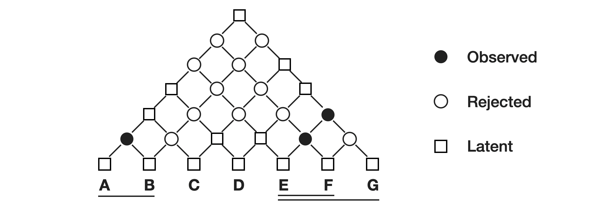

## How to run this baseline for NeCTIS experiments
* Simply create a conda enviroment using `environment.yml` file
* For running Fine grain experiments Please comment out the lines 75 to 80, and uncomment line 81  in `utils_ner.py` file.
* For running coarse level experiments Please comment out line 81 and uncomment lines 75 to 80 in `utils_ner.py` file.
* Make sure there is empty `outputs` folder and `runs` folders created
* Our experiments showed that we need atleast 21 gb of GPU for fine grain experiments and 7 gb for coarse
* Always delete the contents inside `__pycache__` for experiment to experiment to avoid using up cache from other experiments.



## BASELINE
Yao Fu, Chuanqi Tan, Mosha Chen, Songfang Huang and Fei Huang. _Nested Named Entity Recognition with Partially Observed TreeCRFs_. AAAI 2021. [[arxiv](https://arxiv.org/abs/2012.08478)]


Train (coarse level experiments):
```bash
python train.py --output_dir outputs --model_type bert --config_name bert-base-uncased --model_name_or_path bert-base-uncased --train_file data/genia/train.data --predict_file data/genia/dev.data --test_file data/genia/test.data --max_seq_length 64 --per_gpu_train_batch_size 48 --per_gpu_eval_batch_size 48 --do_train --do_predict --learning_rate 3e-5 --num_train_epochs 100 --overwrite_output_dir --save_steps 1000 --dataset GENIA --potential_normalization True --structure_smoothing_p 0.98 --parser_type deepbiaffine --latent_size 5 --seed 12345
```

Train (fine grain level experiments):
```bash
python train.py --output_dir outputs --model_type bert --config_name bert-base-uncased --model_name_or_path bert-base-uncased --train_file data/genia/train.data --predict_file data/genia/dev.data --test_file data/genia/test.data --max_seq_length 64 --per_gpu_train_batch_size 48 --per_gpu_eval_batch_size 48 --do_train --do_predict --learning_rate 3e-5 --num_train_epochs 100 --overwrite_output_dir --save_steps 1000 --dataset GENIA --potential_normalization True --structure_smoothing_p 0.98 --parser_type deepbiaffine --latent_size 86 --seed 12345
```
